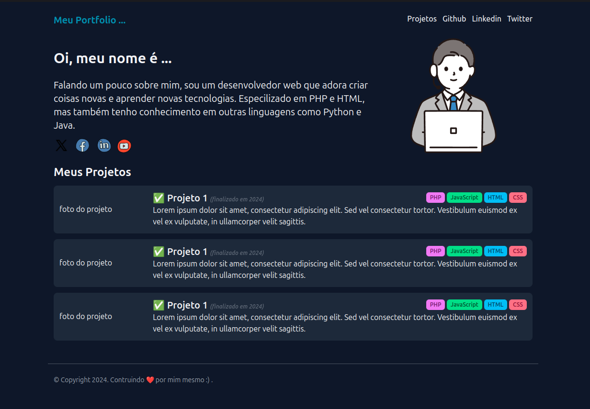

</a>

  

## Projeto Portfólio Dev

O projeto é um site desktop de portfólio para desenvolvedores, com links para projetos e contato do profissional. 
Esse é um dos projetos práticos da formação PHP, um dos conteúdos disponíveis para alunos da Rocketseat.

 

  

## Tecnologias utilizadas

- [**PHP**](https://www.php.net/): Linguagem de programação usada;
- [**Tailwind**](https://tailwindcss.com/): Framework CSS que facilita o desenvolvimento de interfaces modernas e responsivas.

## Licença

Este projeto está licenciado sob a licença MIT - consulte o arquivo LICENSE para mais detalhes.